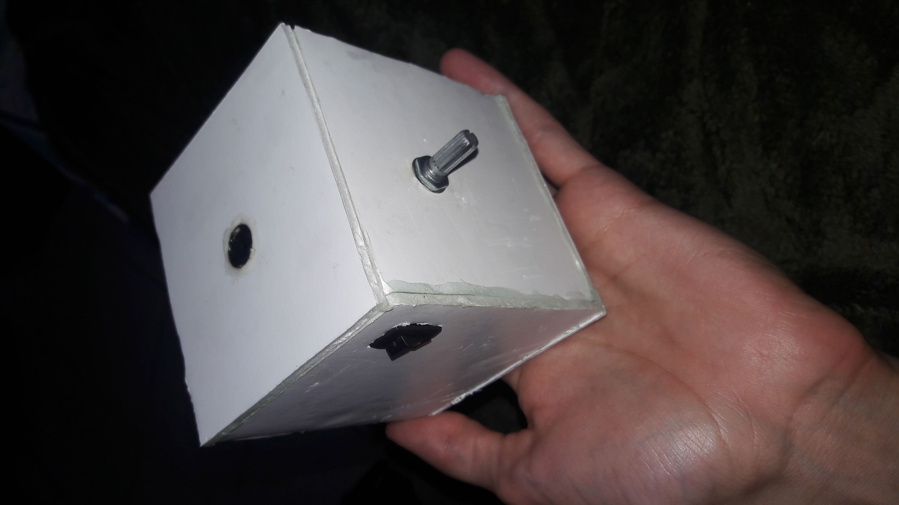
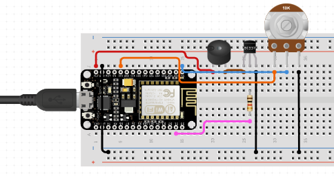

 

  <h3 align="center">Buzz of Love</h3>

  

    A beep soundbox to play nostalgic sounds! With volume control and controls over bluetooth!
     
     
    <a href="https://github.com/xandao6/buzz-of-love"><strong>Explore the docs »</strong></a>
     
    <a href="https://github.com/xandao6/buzz-of-love/issue">Report Bug</a>
    ·
    <a href="https://github.com/xandao6/buzz-of-love/issues">Request Feature</a>
  

<!-- TABLE OF CONTENTS -->

  
Table of Contents

  <ol>
    <li>
      <a href="#about-the-project">About The Project</a>
      <ul>
        <li><a href="#features">Features</a></li>
        <li><a href="#built-with">Built With</a></li>
      </ul>
    </li>
    <li><a href="#roadmap">Roadmap</a></li>
    <li><a href="#contributing">Contributing</a></li>
    <li><a href="#license">License</a></li>
    <li><a href="#contact">Contact</a></li>
  </ol>

<!-- ABOUT THE PROJECT -->
## About The Project

https://user-images.githubusercontent.com/22106326/188331599-086e476a-50e1-4750-aa99-27bc51c83f3f.mp4

  

### Features

* Play beep sounds in RTTTL format
* Control volume with potentiometer
* Select songs with bluetooth

### Built With

* [Arduino](https://www.arduino.cc/) - Arduino programming language
* [ESP32](https://www.espressif.com/en/products/devkits) - ESP32 DevKit V1 microcontroller
* [Buzzer](https://www.adafruit.com/product/160) - Piezo Buzzer
* [Potentiometer](https://www.adafruit.com/product/356) - 10K Linear Potentiometer

<!-- ROADMAP -->
## Roadmap

See the [open issues](https://github.com/xandao6/buzz-of-love/issues) for a list of proposed features (and known issues).

<!-- CONTRIBUTING -->
## Contributing

Contributions are what make the open source community such an amazing place to be learn, inspire, and create. Any contributions you make are **greatly appreciated**.

1. Fork the Project
2. Create your Feature Branch (`git checkout -b feature/AmazingFeature`)
3. Commit your Changes (`git commit -m 'Add some AmazingFeature'`)
4. Push to the Branch (`git push origin feature/AmazingFeature`)
5. Open a Pull Request

<!-- LICENSE -->
## License

Distributed under the MIT License. See [LICENSE](./LICENSE.md) for more information.

Free software =)

<!-- CONTACT -->
## Contact

Alexandre Calil - [@xandao6](https://www.linkedin.com/in/xandao6/) - alexandrecalilmf@gmail.com

Project Link: [https://github.com/xandao6/buzz-of-love](https://github.com/xandao6/buzz-of-love)
